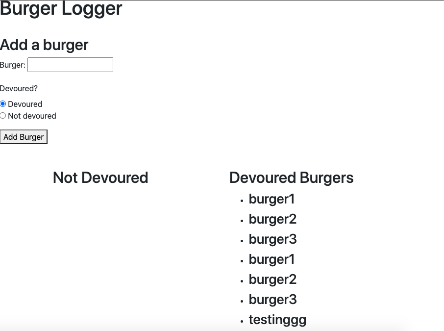

# Burger Logger

# Description
This app allows the user to enter the name of a burger and mark whether it has been devoured or not. The user can then choose to devour the burgers from the list of those which have not yet been devoured.

# Technologies used
- Node
- Express
- Express Handlebars
- MySQL database
- AJAX
- jQuery

# Links
GitHub Repository: https://github.com/ashtonwalden34/burger-logger
Deployed application: https://nameless-brushlands-84131.herokuapp.com/

# Road Map
- Functioning delete button to remove burgers from database
- Mobile first user friendly design